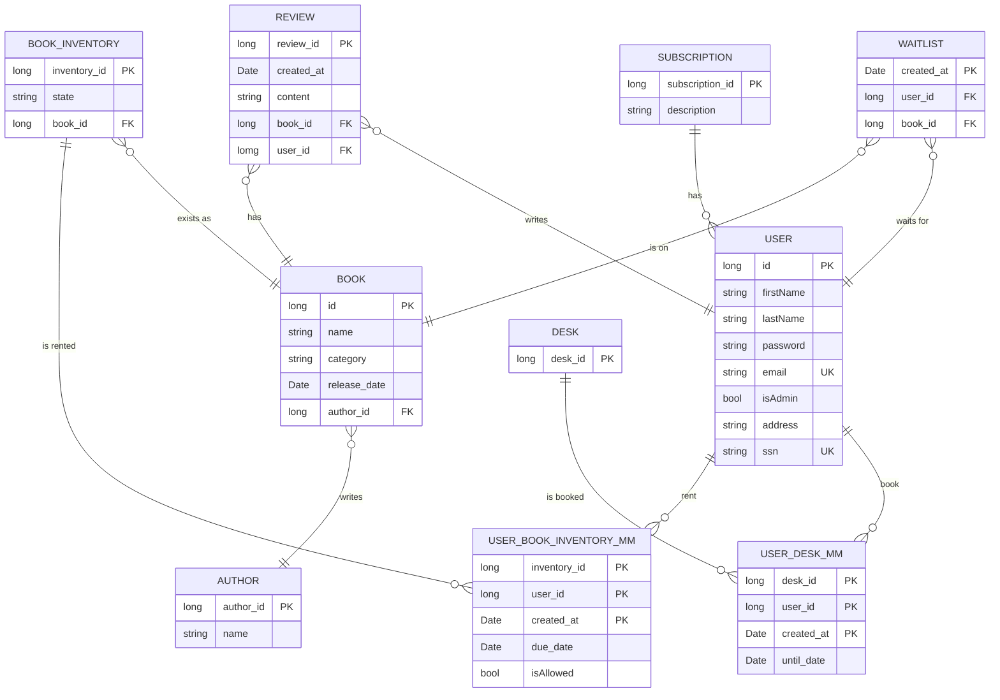

```mermaid
%%{init: {'theme':'corporate'}}%%
erDiagram
    USER {
        long id PK
        string firstName
        string lastName
        string password
        string email UK
        bool isAdmin
        string address
        string ssn UK
    }
    USER ||--o{ USER_BOOK_INVENTORY_MM: rent
    BOOK_INVENTORY ||--o{ USER_BOOK_INVENTORY_MM: "is rented"
    USER_BOOK_INVENTORY_MM {
        long inventory_id PK
        long user_id PK
        Date created_at PK
        Date due_date
        bool isAllowed 
    }
    BOOK_INVENTORY {
        long inventory_id PK
        string state
        long book_id FK
    }
    BOOK_INVENTORY }o--|| BOOK: "exists as"
    BOOK {
        long id PK
        string name
        string category
        Date release_date
        long author_id FK
    }
    BOOK }o--|| AUTHOR: writes
    REVIEW }o--|| BOOK: has
    REVIEW }o--|| USER: writes
    AUTHOR {
        long author_id PK
        string name
    }
    REVIEW {
        long review_id PK
        Date created_at
        string content
        long book_id FK
        lomg user_id FK
    }
    WAITLIST }o--|| BOOK: "is on"
    WAITLIST }o--|| USER: "waits for"
    WAITLIST {
        Date created_at PK
        long user_id FK
        long book_id FK
    }
    DESK {
        long desk_id PK
    }
    USER ||--o{ USER_DESK_MM: book
    DESK ||--o{ USER_DESK_MM: "is booked"
    USER_DESK_MM {
        long desk_id PK
        long user_id PK
        Date created_at PK
        Date until_date  
    }
    SUBSCRIPTION {
        long subscription_id PK
        string description
    }
    SUBSCRIPTION ||--o{ USER: "has"
```
