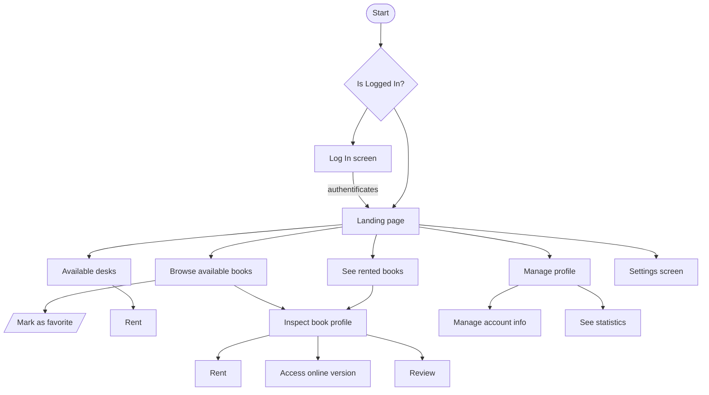

```mermaid
flowchart TD
    A([Start]) --> B{Is Logged In?}
    B --> C[Log In screen]
    B --> DA[Landing page]
    C --> |authentificates| DA
    DA --> E[Browse available books]
    DA --> DAA[Manage profile]
    E --> EA[/Mark as favorite/]
    DA --> DAB[See rented books]
    DA --> DAC[Available desks]
    DA --> DAE[Settings screen]
    DAC --> DACA[Rent]
    DAB --> F
    DAA --> DAAB[Manage account info]
    DAA --> DAAD[See statistics]

    E --> F[Inspect book profile]
    F --> G[Rent]
    F --> I[Access online version]
    F --> K[Review]
```
