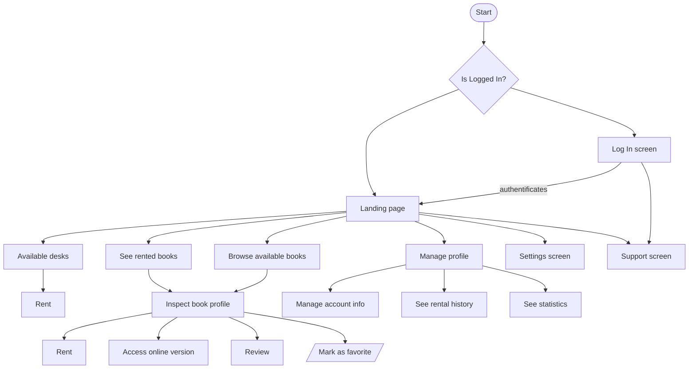

```mermaid
%%{init: {'theme':'corporate'}}%%
flowchart TD
    A([Start]) --> B{Is Logged In?}
    B --> C[Log In screen]
    B --> DA[Landing page]
    C --> |authentificates| DA
    DA --> E[Browse available books]
    DA --> DAA[Manage profile]
    DA --> DAB[See rented books]
    DA --> DAC[Available desks]
    DA --> DAE[Settings screen]
    DA --> DAD[Support screen]
    C --> DAD
    DAC --> DACA[Rent]
    DAB --> F
    DAA --> DAAB[Manage account info]
    DAA --> DAAC[See rental history]
    DAA --> DAAD[See statistics]

    E --> F[Inspect book profile]
    F --> G[Rent]
    F --> I[Access online version]
    F --> K[Review]
    F --> FA[/Mark as favorite/]
```
