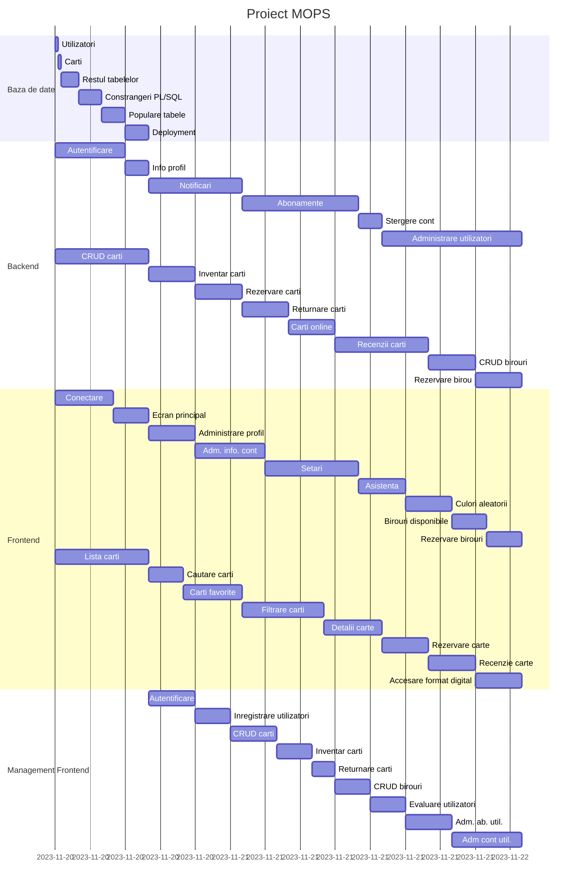

```mermaid
%%{init: {'theme':'corporate'}}%%
gantt
    todayMarker off
    title Proiect MOPS
    dateFormat  YYYY-MM-DDH HH:MM
    section Baza de date
    Utilizatori: d1, 2023-11-20 9:00, 0.25h
    Carti: d2, after d1, 0.25h
    Restul tabelelor: d3, after d2, 1.5h
    Constrangeri PL/SQL: d4, after d3, 2h
    Populare tabele: d5, after d4, 2h
    Deployment: d6, after d5, 2h
    section Backend
    Autentificare: b1, 2023-11-20 9:00, 6h
    Info profil: b2, after b1, 2h

    Notificari: b3, after b2, 8h
    Abonamente: b4, after b3, 10h
    
    
    Stergere cont: b5, after b4, 2h
    Administrare utilizatori: b6, after b5, 12h

    CRUD carti: bb1, 2023-11-20 9:00, 8h

    Inventar carti: bb2, after bb1, 4h
    Rezervare carti: bb3, after bb2, 4h

    Returnare carti: bb4, after bb3, 4h
    Carti online: bb6, after bb4, 4h

    Recenzii carti: bb7, after bb6, 8h

    CRUD birouri: bb8, after bb7, 4h
    Rezervare birou: bb9, after bb8, 4h

    section Frontend
    Conectare: f1, 2023-11-20 9:00, 5h
    Ecran principal: f2, after f1, 3h

    Administrare profil: f3, after f2, 4h
    Adm. info. cont: f4, after f3, 6h

    Setari: f5, after f4, 8h
    Asistenta: f6, after f5, 4h
    Culori aleatorii: f7, after f6, 4h
    Birouri disponibile: f8, after f7, 3h
    Rezervare birouri: f9, after f8, 3h

    Lista carti: ff1, 2023-11-20 9:00, 8h
    Cautare carti: ff2, after ff1, 3h

    Carti favorite: ff3, after ff2, 5h
    Filtrare carti: ff4, after ff3, 7h


    Detalii carte: ff5, after ff4, 5h
    Rezervare carte: ff6, after ff5, 4h
    Recenzie carte: ff7, after ff6, 4h

    Accesare format digital: ff8, after ff7, 4h

    section Management Frontend
    Autentificare: m1, after d6, 4h
    Inregistrare utilizatori: m2, after m1, 3h
    CRUD carti: m3, after m2, 4h
    Inventar carti: m4, after m3, 3h
    Returnare carti: m5, after m4, 2h
    CRUD birouri: m6, after m5, 3h
    Evaluare utilizatori: m7, after m6, 3h
    Adm. ab. util.: m8, after m7, 4h
    Adm cont util.: m9, after m8, 6h
```
